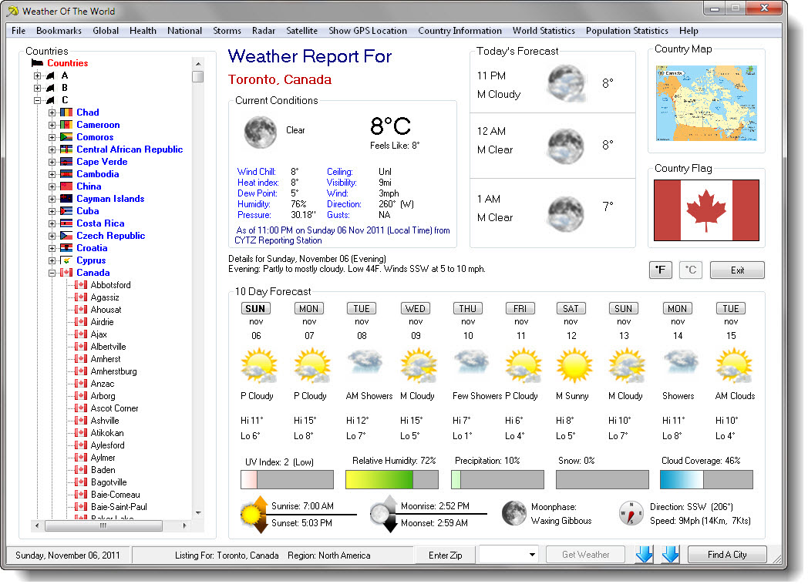



## Weather Of The World Version 3

### Description

This is the ultimate weather program, Weather Of the World will give the weather of all cities in ever countries, Hurricane Tracking, Flying to and from other Countries, their G.P.S. location, facts & statics about that country, time & date, Airport Arrival listing all major airports of a country, Airline information of every airline of all countries, Air quality & UV control report, international calling code for all countries and many more new feature . I have remove the LVbuttons.ocx from program so there will be no need for ocx registration. Made changes to hurricane tracking that did not work properly when there was no hurricane to track. please vote and or give any suggestion you may have. also many thanks to all the programmers on P.S.C. that I have used snippets of their code to create Weather Of The World.
 
### More Info
 

             |
---                |---
**Submitted On**   |2011-11-06 20:18:50
**By**             |[Kenneth Dillon](https://github.com/Planet-Source-Code/PSCIndex/blob/master/ByAuthor/kenneth-dillon.md)
**Level**          |Intermediate
**User Rating**    |4.5 (18 globes from 4 users)
**Compatibility**  |VB 5\.0, VB 6\.0
**Category**       |[Complete Applications](https://github.com/Planet-Source-Code/PSCIndex/blob/master/ByCategory/complete-applications__1-27.md)
**World**          |[Visual Basic](https://github.com/Planet-Source-Code/PSCIndex/blob/master/ByWorld/visual-basic.md)
**Archive File**   |[Weather\_Of2214081162011\.zip](https://github.com/Planet-Source-Code/kenneth-dillon-weather-of-the-world-version-3__1-74166/archive/master.zip)

